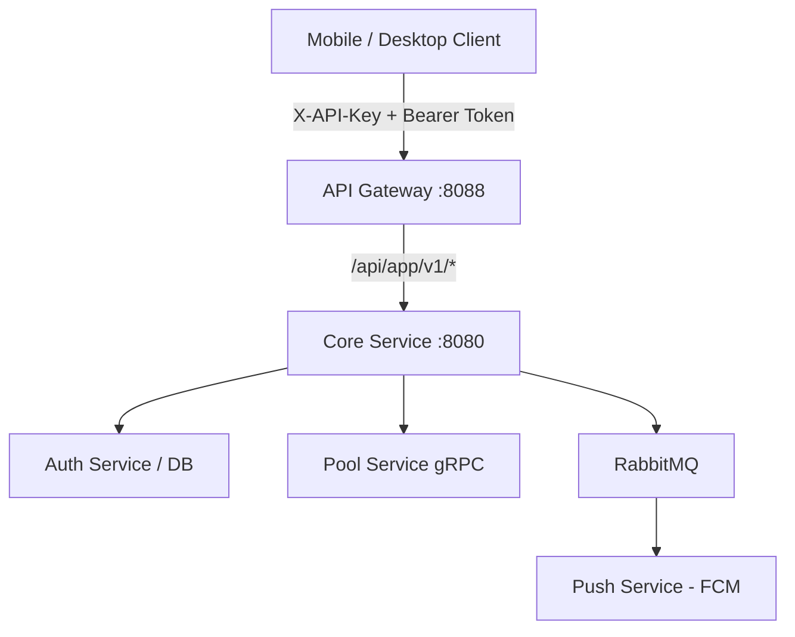

# HubSight CCTV - Mobile & Desktop App API Specification (v1)

A comprehensive technical specification for developers building mobile applications (Flutter, React Native, iOS Swift, Android Kotlin) and desktop applications (Go, Electron, Tauri, C#/.NET) integrating with the **HubSight CCTV** platform.

---

## 1. Architectural Overview & Design Principles

All dedicated APIs for mobile and desktop clients are grouped under the prefix:
```
/api/app/v1/*
```
All client network traffic **must** pass through the **API Gateway Entrypoint** (default port `:8088` or standard production domain `https://cctv.quoctran.space`).



### 1.1. Mandatory API Key Requirement (`X-API-Key`)
Every request to `/api/app/v1/*` **must** include client authentication headers:
- **`X-API-Key`**: Secret client API key (configured and decrypted automatically from the `.hscfg` container).
- *(Backward Compatibility)*: `X-HubSight-App-Key`, `X-Client-ID`, or query parameter `?api_key=...` may be accepted.
- Missing key: Gateway returns `HTTP 401 Unauthorized` (`APP_KEY_REQUIRED`).
- Non-existent or deactivated key in `api_clients`: Gateway returns `HTTP 403 Forbidden` (`INVALID_APP_KEY`).

### 1.2. Emergency Admin Kill-Switch (HTTP 503 Service Unavailable)
System administrators can trigger an emergency maintenance switch (Kill-Switch) from the Web UI (`AppConfigs.tsx` or `PUT /api/settings`):
- When disabled (`app_api_enabled = false`), all client app requests immediately receive:
  - **HTTP Status**: `503 Service Unavailable`
  - **Header**: `Retry-After: 300` (recommends client retry after 5 minutes)
  - **Payload**:
    ```json
    {
      "status": "error",
      "code": "APP_API_DISABLED",
      "maintenance": true,
      "message": "HubSight mobile & desktop app access is temporarily disabled by administrator. Please access via the web portal."
    }
    ```

---

## 2. Endpoint Summary Table

| Functional Group | Method & Route | Bearer Token Required | Summary Description |
| :--- | :--- | :---: | :--- |
| **System** | `GET /api/app/v1/system/status` | No | Check readiness, version v1, and active feature flags |
| **Authentication** | `POST /api/app/v1/auth/login` | No | Username/Password login, issuing session tokens or 2FA challenge |
| | `POST /api/app/v1/auth/2fa/verify` | No | Verify 6-digit TOTP code or backup recovery code |
| | `POST /api/app/v1/auth/refresh` | No | Issue new access token using refresh token |
| | `POST /api/app/v1/auth/change-password`| Yes | Periodic or first-login password update (`must_change_password`) |
| | `POST /api/app/v1/auth/logout` | Yes | Invalidate current active session |
| **Profile** | `GET /api/app/v1/profile` | Yes | Retrieve user profile, role, and fine-grained permissions |
| | `PATCH /api/app/v1/profile` | Yes | Update full name, timezone, locale (vi/en), theme, push options |
| | `GET /api/app/v1/profile/sessions` | Yes | List all active login sessions across devices |
| | `DELETE /api/app/v1/profile/sessions/:id`| Yes | Terminate/revoke remote session |
| **Camera Live**| `GET /api/app/v1/cameras` | Yes | List cameras with status, `thumbnail_url`, and `stream_name` |
| | `GET /api/app/v1/cameras/:id` | Yes | Single camera configuration, `thumbnail_url`, and metrics |
| | `GET /api/app/v1/cameras/:id/thumbnail`| Yes | **[App Optimized]** Fetch live frame (JPEG 640p 15FPS) as thumbnail |
| | `POST /api/app/v1/cameras/:id/live/webrtc` | Yes | Exchange SDP Offer/Answer for single WebRTC live stream |
| | `POST /api/app/v1/cameras/:id/live/heartbeat`| Yes | Keep-alive heartbeat for active stream (30s interval) |
| | `POST /api/app/v1/cameras/:id/live/release` | Yes | Teardown live stream and release media engine resources |
| **Multi-View** | `POST /api/app/v1/cameras/live/batch-webrtc` | Yes | **[App Exclusive]** Parallel SDP negotiation for multiple cameras |
| | `POST /api/app/v1/cameras/live/batch-heartbeat`| Yes | **[Battery/Network Opt]** Single heartbeat request for all visible cameras |
| | `POST /api/app/v1/cameras/live/batch-release` | Yes | Simultaneous stream teardown when leaving multi-view grid |
| **Archive** | `GET /api/app/v1/cameras/:id/archive/calendar` | Yes | List calendar days containing recorded video (`YYYY-MM-DD`) |
| | `GET /api/app/v1/cameras/:id/archive/timeline` | Yes | List recorded video segments with AI event flags |
| | `GET /api/app/v1/archive/:recording_id/play` | Yes | Retrieve MP4 playback URL (supports HTTP Range & 302 Redirect) |
| | `GET /api/app/v1/archive/:recording_id/thumbnail`| Yes | Retrieve thumbnail image for recorded video segment |
| **Notifications** | `POST /api/app/v1/notifications/push-token` | Yes | Register FCM Device Token for Firebase push notifications |
| | `DELETE /api/app/v1/notifications/push-token`| Yes | Unregister FCM Device Token upon logout |
| | `GET /api/app/v1/notifications/unread-count` | Yes | Lightweight unread counter for updating app launcher badge |
| | `GET /api/app/v1/notifications` | Yes | Paginated notifications list with category filtering |
| | `PATCH /api/app/v1/notifications/:id/read` | Yes | Mark single notification as read |
| | `POST /api/app/v1/notifications/read-all` | Yes | Mark all notifications as read |
| | `DELETE /api/app/v1/notifications/:id` | Yes | Delete single notification |

---

## 3. Detailed API & Data Contracts

### 3.1. System Status & Readiness
#### `GET /api/app/v1/system/status`
Headers:
```http
X-API-Key: hs_mob_client_default
```
Response `200 OK`:
```json
{
  "status": "ok",
  "app_api_version": "v1",
  "app_api_enabled": true,
  "features": {
    "live_streaming": true,
    "multi_view_batch": true,
    "archive_playback": true,
    "fcm_push": true,
    "two_factor_auth": true
  },
  "server_time": "2026-09-09T04:14:47.919Z"
}
```

---

### 3.2. Authentication & 2FA
#### `POST /api/app/v1/auth/login`
Headers: `X-API-Key`  
Request Body:
```json
{
  "username": "admin",
  "password": "SecurePassword123!",
  "device_name": "iPhone 15 Pro",
  "platform": "mobile_ios",
  "device_id": "device_uuid_abcd_1234"
}
```

Response Case 1: Direct successful login (`200 OK`):
```json
{
  "status": "ok",
  "token": "hs_tok_eyJhbGciOi...",
  "refresh_token": "hs_ref_a91b2c...",
  "must_change_password": false,
  "user": {
    "id": "usr_9918231",
    "username": "admin",
    "full_name": "Administrator",
    "role": "admin",
    "locale": "en",
    "timezone": "UTC",
    "permissions": ["*"]
  }
}
```

Response Case 2: Two-Factor Authentication Challenge (`200 OK` with `requires_2fa: true`):
```json
{
  "status": "ok",
  "requires_2fa": true,
  "pre_auth_token": "pre_auth_tok_81726354"
}
```

#### `POST /api/app/v1/auth/2fa/verify`
Headers: `X-API-Key`  
Request Body:
```json
{
  "pre_auth_token": "pre_auth_tok_81726354",
  "totp_code": "582910",
  "recovery_code": ""
}
```

---

### 3.3. Camera Catalog & Thumbnails

#### `GET /api/app/v1/cameras`
Headers: `X-API-Key: hs_mob_client_default`, `Authorization: Bearer <token>`

Response `200 OK`:
```json
{
  "status": "ok",
  "cameras": [
    {
      "id": "cam_front_door",
      "name": "Front Gate",
      "host": "rtsp://192.168.1.100:554/live",
      "is_active": true,
      "is_stopped": false,
      "enable_ai": true,
      "thumbnail_url": "/api/app/v1/cameras/cam_front_door/thumbnail",
      "stream_name": "cam_cam_front_door_thumb"
    },
    {
      "id": "cam_garage",
      "name": "Garage",
      "host": "rtsp://192.168.1.101:554/live",
      "is_active": true,
      "is_stopped": false,
      "enable_ai": false,
      "thumbnail_url": "/api/app/v1/cameras/cam_garage/thumbnail",
      "stream_name": "cam_cam_garage_thumb"
    }
  ]
}
```

#### `GET /api/app/v1/cameras/:id/thumbnail` (or `/snapshot`)
Fetches the latest JPEG snapshot frame extracted directly from the persistent **640p 15FPS** camera stream in the media router.

- **Headers**:
  ```http
  X-API-Key: hs_mob_client_default
  Authorization: Bearer <token>
  ```
- **Query String Support (for Mobile App Image Widgets)**:
  If the platform's image widget (Flutter / React Native) does not support custom HTTP headers, queries can be passed directly:
  ```http
  GET /api/app/v1/cameras/:id/thumbnail?api_key=hs_mob_client_default&token=<user_token>
  ```
- **Response**: `200 OK`
  - `Content-Type: image/jpeg`
  - `Cache-Control: no-cache, no-store, must-revalidate`
  - Binary JPEG image data (standard 640p).
  - If camera is stopped (`is_stopped=true`), returns `503 Service Unavailable`.

##### Integration Examples:
**Flutter:**
```dart
Image.network(
  '$gatewayUrl${camera.thumbnailUrl}?api_key=$apiKey&token=$userToken',
  fit: BoxFit.cover,
  errorBuilder: (context, error, stackTrace) => const PlaceholderCameraCard(),
)
```

**React Native:**
```tsx
<Image
  source={{
    uri: `${gatewayUrl}${camera.thumbnail_url}?api_key=${apiKey}&token=${userToken}`,
    headers: { 'Cache-Control': 'no-cache' },
  }}
  style={styles.cameraThumbnail}
/>
```

---

### 3.4. Live Streaming & Multi-View Batching

#### `POST /api/app/v1/cameras/:id/live/webrtc` (Single Stream)
Headers: `X-API-Key`, `Authorization: Bearer <token>`, `Content-Type: text/plain` (or JSON)  
Request Body:
```
v=0
o=- 0 0 IN IP4 127.0.0.1
s=HubSight WebRTC Session
...
```
Response `200 OK`: Returns the `SDP Answer` string ready to feed into the WebRTC `RTCPeerConnection.setRemoteDescription`.

#### `POST /api/app/v1/cameras/live/batch-webrtc` (Multi-View Batching)
Optimized specifically for mobile clients displaying a 4/9/16 camera grid. The client sends camera IDs and corresponding SDP Offers; the server performs parallel gRPC negotiation and returns all results in a single round-trip:
Request Body:
```json
{
  "requests": [
    { "camera_id": "cam_front_door", "sdp_offer": "v=0\r\no=..." },
    { "camera_id": "cam_backyard", "sdp_offer": "v=0\r\no=..." }
  ]
}
```
Response `200 OK`:
```json
{
  "results": [
    {
      "camera_id": "cam_front_door",
      "success": true,
      "sdp_answer": "v=0\r\no=...",
      "stream_name": "cam_front_door_client_0",
      "conn_index": 2
    },
    {
      "camera_id": "cam_backyard",
      "success": true,
      "sdp_answer": "v=0\r\no=...",
      "stream_name": "cam_backyard_client_0",
      "conn_index": 2
    }
  ]
}
```

#### `POST /api/app/v1/cameras/live/batch-heartbeat`
Maintains live stream connections for all currently visible cameras:
```json
{
  "camera_ids": ["cam_front_door", "cam_backyard"]
}
```
Response: `{"status": "ok"}`

---

### 3.5. Recorded Video & NVR Playback

#### `GET /api/app/v1/cameras/:id/archive/calendar?month=2026-09`
Response `200 OK`:
```json
{
  "days": ["2026-09-01", "2026-09-02", "2026-09-07", "2026-09-08", "2026-09-09"]
}
```

#### `GET /api/app/v1/cameras/:id/archive/timeline?date=2026-09-09`
Response `200 OK`:
```json
{
  "camera_id": "cam_front_door",
  "date": "2026-09-09",
  "segments": [
    {
      "id": "rec_01J8G92",
      "start_at": "2026-09-09T08:00:00Z",
      "end_at": "2026-09-09T08:05:00Z",
      "duration_seconds": 300,
      "size_bytes": 15428900,
      "has_event": true,
      "event_type": "person"
    }
  ]
}
```

#### `GET /api/app/v1/archive/:recording_id/play`
Response `200 OK`:
```json
{
  "recording_id": "rec_01J8G92",
  "play_url": "https://dl.learncurv.space/bucket-faces-cctv/recordings/cam_front_door/2026-09-09/08-00-00.mp4?X-Amz-Expires=7200...",
  "expires_in_seconds": 7200
}
```
*(If the client specifies header `Accept: video/mp4` or query parameter `?redirect=true`, the server automatically redirects with `302 Found` directly to the video URL).*

---

### 3.6. Push Notification Registration & Management (FCM)

#### `POST /api/app/v1/notifications/push-token`
Request Body:
```json
{
  "token": "eXamPle_fcm_token_device_abcdef123456",
  "platform": "mobile_android",
  "device_name": "Galaxy S24 Ultra"
}
```
Response `200 OK`:
```json
{
  "status": "ok",
  "message": "FCM device token registered successfully."
}
```

#### `GET /api/app/v1/notifications/unread-count`
Ultra-lightweight endpoint for app badge updates:
```json
{
  "unread_count": 4
}
```

---

## 4. Sample Client Implementation (Flutter / Dart)

```dart
import 'dart:convert';
import 'package:http/http.dart' as http;

class HubSightApiClient {
  final String baseUrl; // e.g. 'https://cctv.quoctran.space'
  final String apiKey;  // e.g. 'hs_mob_client_default'
  String? bearerToken;

  HubSightApiClient({required this.baseUrl, required this.apiKey});

  Map<String, String> get _headers => {
    'Content-Type': 'application/json',
    'X-API-Key': apiKey,
    if (bearerToken != null) 'Authorization': 'Bearer $bearerToken',
  };

  // 1. Check system readiness & Kill-Switch
  Future<bool> checkSystemReadiness() async {
    final res = await http.get(
      Uri.parse('$baseUrl/api/app/v1/system/status'),
      headers: _headers,
    );

    if (res.statusCode == 503) {
      final body = jsonDecode(res.body);
      throw Exception(body['message'] ?? 'System under maintenance');
    }
    return res.statusCode == 200;
  }

  // 2. Authenticate
  Future<Map<String, dynamic>> login(String username, String password) async {
    final res = await http.post(
      Uri.parse('$baseUrl/api/app/v1/auth/login'),
      headers: _headers,
      body: jsonEncode({
        'username': username,
        'password': password,
        'device_name': 'Mobile Client',
        'platform': 'flutter',
      }),
    );

    final data = jsonDecode(res.body);
    if (res.statusCode == 200 && data['token'] != null) {
      bearerToken = data['token'];
    }
    return data;
  }

  // 3. Register FCM Token on app launch
  Future<void> registerFcmToken(String fcmToken) async {
    await http.post(
      Uri.parse('$baseUrl/api/app/v1/notifications/push-token'),
      headers: _headers,
      body: jsonEncode({
        'token': fcmToken,
        'platform': 'mobile_flutter',
      }),
    );
  }
}
```
