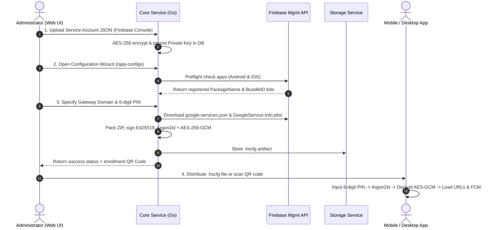

# HubSight CCTV - Application Configuration Specification (.hscfg)

This document serves as the technical specification and client integration guide for AI agents, backend engineers, mobile engineers (Flutter / React Native / Native iOS & Android), and desktop engineers (Tauri / Electron / Go / C#).

---

## 1. Overview & Architectural Problem Statement

### 1.1. Context & Objectives
Within the **HubSight Surveillance & Playback Platform** ecosystem, end users operate mobile and desktop applications to monitor live camera feeds, play back NVR recorded footage, and receive real-time push notifications (FCM Push Notifications).

Previously, provisioning an application required entering complex parameters manually:
- API Gateway URLs, WebRTC URLs, and WebSocket Relay URLs.
- Client identity keys (`client_id`) and authentication secrets (`client_secret`).
- Firebase Cloud Messaging configuration files (`google-services.json` for Android and `GoogleService-Info.plist` for iOS).
- Internal CA root certificates (`ca_cert.pem`) if deployed in private network environments (On-Premise / Private CA).

### 1.2. The Solution: Multi-Layered Secure Configuration Container (`.hscfg`)
HubSight adopts a proprietary secure container format: **`.hscfg` (HubSight Configuration)**:
1. **Zero-Configuration Setup**: Administrators generate the configuration on the HubSight Web UI, then export the `.hscfg` file or distribute a quick-enrollment QR code.
2. **Multi-Layered Security via a 6-digit PIN**:
   - The `.hscfg` file is symmetrically encrypted with **AES-256-GCM**.
   - The encryption key is derived from a user-supplied **6-digit PIN** using a memory-hard algorithm resistant to GPU/ASIC attacks: **Argon2id** (64MB RAM, 4 rounds).
   - The inner payload is digitally signed with **Ed25519** to guarantee integrity and prevent tampering.
3. **Secure Distribution**: Containers are stored on internal object storage and downloaded exclusively through time-limited **Presigned URLs** (24 hours for QR codes, 15 minutes for Admin downloads).
4. **Unified Gateway Architecture**: All REST API and WebSocket Relay endpoints route through the Nginx Reverse Proxy & API Gateway (default port 80/443 or local 8088). **The only exception is WebRTC media streaming**, which transmits RTP/ICE packets directly via port `:8555`.

---

## 2. Binary Layout of the `.hscfg` Container

### 2.1. Binary Structure

The `.hscfg` file consists of 4 contiguous segments:

```text
+-----------------------+--------------------+---------------------+-----------------------------------------+
| Magic Header (6 bytes)| Salt (16 bytes)    | Nonce (12 bytes)    | Ciphertext + GCM Auth Tag (Variable)    |
| 'H' 'S' 'C' 'F' 'G' 0x01 | Cryptographic Salt | AES-GCM IV / Nonce  | Encrypted ZIP archive + 16-byte GCM Tag |
+-----------------------+--------------------+---------------------+-----------------------------------------+
```

| Field | Size | Description |
| :--- | :--- | :--- |
| **Magic Header** | 6 bytes | Fixed ASCII string `HSCFG` followed by version byte `0x01` (`[0x48, 0x53, 0x43, 0x46, 0x47, 0x01]`). |
| **Argon2id Salt** | 16 bytes | 16 cryptographically random bytes (`crypto/rand`), used as salt for Argon2id. |
| **GCM Nonce** | 12 bytes | 12 cryptographically random bytes standard for AES-GCM (Initialization Vector). |
| **Ciphertext + Tag** | N + 16 bytes | AES-256-GCM encrypted ZIP archive. The final 16 bytes contain the GCM Authentication Tag. |

### 2.2. Additional Authenticated Data (AAD)
During AES-256-GCM encryption and decryption, the mandatory AAD parameter passed to the cipher is the **Magic Header (6 bytes)**:
```text
AAD = []byte("HSCFG\x01")
```
If an adversary modifies the header or tampers with the file version, AES-GCM decryption will immediately trigger an integrity check error (`authentication failed / integrity check failure`).

### 2.3. Cryptographic Parameters

| Component | Algorithm | Parameters |
| :--- | :--- | :--- |
| **Key Derivation (KDF)** | Argon2id | - Iterations (`time / iterations`): `4`<br>- Memory (`memory`): `64 * 1024` KiB (64 MiB)<br>- Parallelism (`parallelism / threads`): `2`<br>- Output Key Length (`keyLength`): `32 bytes` (256-bit) |
| **Payload Encryption** | AES-256-GCM | - Key: 256-bit (derived via Argon2id)<br>- Nonce: 12 bytes<br>- Auth Tag: 16 bytes (128-bit MAC)<br>- AAD: `HSCFG\x01` |
| **Digital Signature** | Ed25519 | - Ed25519 keypair (32-byte public key, 64-byte private key) generated per packaging session.<br>- Private key signs raw unencrypted ZIP archive bytes before encryption.<br>- Public key and digital signature are embedded in `metadata.yml`. |

---

## 3. Decrypted Payload Structure (ZIP Archive)

Upon successful AES-256-GCM decryption, the resulting byte stream is a standard **ZIP Archive** containing the following configuration files:

```text
decrypted_payload.zip/
├── metadata.yml              # Origin info, creation timestamp, Ed25519 digital signature
├── urls.yml                  # Base URLs for connecting to HubSight services
├── key.yml                   # Client credentials and permitted API scopes
├── google-services.json      # (Optional) Firebase FCM configuration for Android
├── GoogleService-Info.plist  # (Optional) Firebase FCM configuration for iOS
└── ca_cert.pem               # (Optional) Root CA certificate for private PKI
```

### 3.1. `metadata.yml`
```yaml
format_version: "1.0"
config_id: "cfg_c1234567890abcdefgh"
name: "Production HQ Mobile & Desktop"
description: "Standard configuration profile for building security personnel"
created_by: "admin"
created_at_utc: "2026-09-08T08:30:00Z"
generator: "HubSight Core Packaging Engine"
ed25519_public_key: "0123456789abcdef0123456789abcdef0123456789abcdef0123456789abcdef"
signature: "abcdef0123456789abcdef0123456789abcdef0123456789abcdef0123456789abcdef0123456789abcdef0123456789abcdef0123456789abcdef0123456789"
```

### 3.2. `urls.yml`
> [!IMPORTANT]
> **Unified Gateway Rule**:
> All API and WebSocket traffic must route through the primary Gateway (ports 80/443 or local 8088). Never connect directly to internal microservice ports (`8080`, `3001`, `1984`).
> The only exception is WebRTC RTP/ICE media streaming on port `:8555`.

```yaml
gateway_url: "https://cctv.yourdomain.com"
api_base_url: "https://cctv.yourdomain.com/api"
relay_ws_url: "wss://cctv.yourdomain.com/relay"
webrtc_base_url: "https://cctv.yourdomain.com:8555"
```

### 3.3. `key.yml`
```yaml
client_id: "client_pub_9876543210"
client_secret: "sec_secretkey_sample_token"
client_name: "Mobile Patrol App"
allowed_scopes:
  - "cameras:view"
  - "playback:view"
  - "notifications:receive"
```

### 3.4. `google-services.json` & `GoogleService-Info.plist`
- Automatically fetched by the system directly from the **Google Firebase Management API** (`https://firebase.googleapis.com/v1beta1/...`) using the Service Account JSON uploaded by the administrator.
- Contains API Key, Project ID, Storage Bucket, and Messaging Sender ID for initializing Firebase SDKs on Android and iOS.

---

## 4. Backend Architecture & Processing Flows



### 4.1. Backend Package Structure
- `services/shared/pkg/appconfig/crypto.go`: Functions `DeriveKey(pin, salt)`, `EncryptContainer(...)`, `DecryptContainer(...)`.
- `services/shared/pkg/appconfig/packager.go`: Function `BuildAppConfigPayload(...)` for packing ZIP archive and creating Ed25519 signatures.
- `services/shared/pkg/google/firebase_management.go`: Obtains OAuth2 Bearer Tokens via Service Account and queries Firebase Management API for Android/iOS configurations.
- `services/shared/pkg/api/app_config.go`: REST Handlers for `/api/app-configs/*`.
- `services/shared/pkg/models/app_config.go`: GORM Model `AppConfig`.

### 4.2. API Endpoint Directory

| Method | Endpoint | Description | RBAC Permission |
| :--- | :--- | :--- | :--- |
| `GET` | `/api/app-configs` | List generated configuration profiles | `app_configs:manage` |
| `POST` | `/api/app-configs/generate` | Create, package, and encrypt `.hscfg` | `app_configs:manage` |
| `GET` | `/api/app-configs/:id/download` | Download binary `.hscfg` file | `app_configs:manage` |
| `GET` | `/api/app-configs/:id/qr` | Generate QR code with presigned download URL (24h) | `app_configs:manage` |
| `DELETE` | `/api/app-configs/:id` | Delete profile and stored file | `app_configs:manage` |
| `GET` | `/api/google-service-accounts/:id/preflight-apps` | Verify Android/iOS app status in Firebase | `google_service_accounts:manage` |

---

## 5. Client Integration Guide (Mobile & Desktop Apps)

### 5.1. QR Code Payload Structure
When scanning the setup QR code, the decoded data is a JSON string:
```json
{
  "v": 1,
  "config_id": "cfg_c1234567890abcdefgh",
  "name": "Production HQ",
  "download_url": "https://cctv.yourdomain.com/api/storage/presigned/...",
  "sha256": "8a3f...b12c"
}
```
Client workflow:
1. Issue HTTP GET to `download_url` to retrieve the `.hscfg` binary byte array.
2. Verify that the SHA-256 hash of the downloaded bytes matches the `sha256` field from the QR code.

---

### 5.2. Container Decryption Algorithm (Pseudocode)

```python
# 1. Verify Magic Header
header = file_bytes[0:6]
if header != b"HSCFG\x01":
    raise Exception("Invalid .hscfg header format")

# 2. Extract binary segments
salt = file_bytes[6:22]        # 16 bytes
nonce = file_bytes[22:34]      # 12 bytes
ciphertext_and_tag = file_bytes[34:] # Remaining bytes

# 3. Derive 256-bit AES key from 6-digit PIN using Argon2id
aes_key = argon2id_kdf(
    password=pin_string.encode('utf-8'),
    salt=salt,
    time_cost=4,
    memory_cost=65536, # 64 MB
    parallelism=2,
    key_length=32
)

# 4. Decrypt AES-256-GCM with AAD
aad = b"HSCFG\x01"
zip_payload_bytes = aes_gcm_decrypt(
    key=aes_key,
    nonce=nonce,
    ciphertext_and_tag=ciphertext_and_tag,
    aad=aad
)

# 5. Unpack ZIP archive strictly in memory
zip_archive = ZipFile(io.BytesIO(zip_payload_bytes))
urls_content = zip_archive.read("urls.yml")
key_content = zip_archive.read("key.yml")
metadata_content = zip_archive.read("metadata.yml")

# 6. Verify Ed25519 digital signature
verify_ed25519_signature(
    public_key=metadata.ed25519_public_key,
    signature=metadata.signature,
    data=zip_payload_bytes
)
```

---

### 5.3. Flutter / Dart Implementation Guide

#### Step 1: Add dependencies to `pubspec.yaml`
```yaml
dependencies:
  flutter:
    sdk: flutter
  cryptography: ^2.7.0     # Argon2id, AES-GCM, Ed25519 via WebAssembly / FFI
  archive: ^3.6.1          # In-memory ZIP decoding
  yaml: ^3.1.2             # YAML parsing
  flutter_secure_storage: ^9.2.2 # Keychain / Keystore persistence
  firebase_core: ^3.0.0    # Dynamic Firebase initialization
```

#### Step 2: Decryption Logic (`hscfg_decoder.dart`)
```dart
import 'dart:typed_data';
import 'package:cryptography/cryptography.dart';
import 'package:archive/archive.dart';
import 'package:yaml/yaml.dart';

class HscfgDecryptedResult {
  final Map<String, dynamic> urls;
  final Map<String, dynamic> key;
  final Map<String, dynamic> metadata;
  final String? googleServicesJson;
  final String? googleServiceInfoPlist;
  final String? caCertPem;

  HscfgDecryptedResult({
    required this.urls,
    required this.key,
    required this.metadata,
    this.googleServicesJson,
    this.googleServiceInfoPlist,
    this.caCertPem,
  });
}

class HscfgDecoder {
  static const List<int> magicHeader = [0x48, 0x53, 0x43, 0x46, 0x47, 0x01]; // HSCFG\x01

  static Future<HscfgDecryptedResult> decrypt({
    required Uint8List fileBytes,
    required String pin6Digits,
  }) async {
    // 1. Check minimum length and magic header
    if (fileBytes.length < 34 + 16) {
      throw Exception('Container file is corrupted or too short.');
    }

    for (int i = 0; i < 6; i++) {
      if (fileBytes[i] != magicHeader[i]) {
        throw Exception('Invalid file format (Magic Header mismatch).');
      }
    }

    // 2. Extract Salt, Nonce, and Ciphertext
    final salt = fileBytes.sublist(6, 22);
    final nonce = fileBytes.sublist(22, 34);
    final ciphertextWithTag = fileBytes.sublist(34);

    // 3. Derive key with Argon2id
    final kdf = Argon2id(
      parallelism: 2,
      memory: 65536, // 64 MB
      iterations: 4,
      hashLength: 32,
    );

    final secretKey = await kdf.deriveKey(
      secretKey: SecretKey(Uint8List.fromList(pin6Digits.codeUnits)),
      nonce: salt,
    );

    // 4. Decrypt AES-256-GCM with AAD
    final aesGcm = AesGcm.with256bits();
    
    // Split trailing 16-byte MAC Tag
    final cipherLen = ciphertextWithTag.length - 16;
    final cipherText = ciphertextWithTag.sublist(0, cipherLen);
    final macTag = ciphertextWithTag.sublist(cipherLen);

    final secretBox = SecretBox(
      cipherText,
      nonce: nonce,
      mac: Mac(macTag),
    );

    final decryptedZipBytes = await aesGcm.decrypt(
      secretBox,
      secretKey: secretKey,
      aad: magicHeader,
    );

    // 5. Unpack ZIP Archive strictly in memory
    final archive = ZipDecoder().decodeBytes(decryptedZipBytes);
    
    String? urlsYaml;
    String? keyYaml;
    String? metadataYaml;
    String? googleServices;
    String? googleServiceInfo;
    String? caCert;

    for (final file in archive) {
      if (file.isFile) {
        final content = String.fromCharCodes(file.content as List<int>);
        switch (file.name) {
          case 'urls.yml':
            urlsYaml = content;
            break;
          case 'key.yml':
            keyYaml = content;
            break;
          case 'metadata.yml':
            metadataYaml = content;
            break;
          case 'google-services.json':
            googleServices = content;
            break;
          case 'GoogleService-Info.plist':
            googleServiceInfo = content;
            break;
          case 'ca_cert.pem':
            caCert = content;
            break;
        }
      }
    }

    if (urlsYaml == null || keyYaml == null) {
      throw Exception('Missing required urls.yml or key.yml in container.');
    }

    return HscfgDecryptedResult(
      urls: Map<String, dynamic>.from(loadYaml(urlsYaml) as Map),
      key: Map<String, dynamic>.from(loadYaml(keyYaml) as Map),
      metadata: metadataYaml != null ? Map<String, dynamic>.from(loadYaml(metadataYaml) as Map) : {},
      googleServicesJson: googleServices,
      googleServiceInfoPlist: googleServiceInfo,
      caCertPem: caCert,
    );
  }
}
```

#### Step 3: Dynamic Firebase Initialization from Decrypted Payload
In Flutter, after obtaining `googleServicesJson` or `googleServiceInfoPlist`, initialize Firebase programmatically without baking static plist/json files into application assets:

```dart
import 'dart:convert';
import 'dart:io';
import 'package:firebase_core/firebase_core.dart';

Future<void> initFirebaseFromConfig(HscfgDecryptedResult config) async {
  if (Platform.isAndroid && config.googleServicesJson != null) {
    final parsed = jsonDecode(config.googleServicesJson!);
    final client = parsed['client'][0];
    final projectInfo = parsed['project_info'];

    final options = FirebaseOptions(
      apiKey: client['api_key'][0]['current_key'],
      appId: client['client_info']['mobilesdk_app_id'],
      messagingSenderId: projectInfo['project_number'],
      projectId: projectInfo['project_id'],
      storageBucket: projectInfo['storage_bucket'],
    );

    await Firebase.initializeApp(options: options);
  } else if (Platform.isIOS && config.googleServiceInfoPlist != null) {
    // Parse plist and extract API_KEY, GOOGLE_APP_ID, GCM_SENDER_ID, PROJECT_ID
  }
}
```

---

### 5.4. React Native / TypeScript Implementation

```typescript
import QuickCrypto from 'react-native-quick-crypto';
import { unzip } from 'react-native-zip-archive';

export async function decryptHscfg(fileBuffer: Buffer, pin: string) {
  const magic = fileBuffer.subarray(0, 6).toString('utf-8');
  if (magic !== 'HSCFG\x01') {
    throw new Error('Invalid .hscfg file format');
  }

  const salt = fileBuffer.subarray(6, 22);
  const nonce = fileBuffer.subarray(22, 34);
  const ciphertextAndTag = fileBuffer.subarray(34);
  const authTag = ciphertextAndTag.subarray(ciphertextAndTag.length - 16);
  const ciphertext = ciphertextAndTag.subarray(0, ciphertextAndTag.length - 16);

  // Derive key via Argon2id
  const key = await deriveArgon2id(pin, salt, {
    iterations: 4,
    memory: 65536,
    parallelism: 2,
    keyLength: 32,
  });

  const decipher = QuickCrypto.createDecipheriv('aes-256-gcm', key, nonce);
  decipher.setAAD(Buffer.from('HSCFG\x01', 'utf-8'));
  decipher.setAuthTag(authTag);

  const decryptedZip = Buffer.concat([decipher.update(ciphertext), decipher.final()]);
  return decryptedZip;
}
```

---

### 5.5. Desktop Implementation (Go / Tauri / Electron)

Using the standard HubSight Go package:

```go
package main

import (
	"fmt"
	"os"

	"cctv/shared/pkg/appconfig"
)

func main() {
	hscfgBytes, err := os.ReadFile("hubsight_profile.hscfg")
	if err != nil {
		panic(err)
	}

	pin := "123456"
	payload, err := appconfig.DecryptContainer(hscfgBytes, pin)
	if err != nil {
		fmt.Printf("Decryption failed: %v\n", err)
		return
	}

	fmt.Printf("Decryption succeeded! Gateway URL: %s\n", payload.URLs.GatewayURL)
	fmt.Printf("API Base URL: %s\n", payload.URLs.APIBaseURL)
	fmt.Printf("Client ID: %s\n", payload.Key.ClientID)
}
```

---

### 5.6. Transmitting Device Metadata & Fingerprint on Login

When client applications authenticate (`POST /api/auth/login` or `POST /api/auth/2fa/verify`), they attach `device_info` in the JSON payload and pass matching `X-Device-*` headers:

#### Sample Request:
```http
POST /api/auth/login HTTP/1.1
Host: gateway.hubsight.internal
Content-Type: application/json
X-Client-ID: cli_1234567890
X-Device-Fingerprint: 3b1a8d0ef9...
X-Device-Label: Apple iPhone 15 Pro (iOS 17.5.1) • App v1.2.0
X-Client-Type: mobile_ios

{
  "username": "user1",
  "password": "SecretPassword123!",
  "device_info": {
    "fingerprint": "3b1a8d0ef9...",
    "device_label": "Apple iPhone 15 Pro (iOS 17.5.1) • App v1.2.0",
    "client_type": "mobile_ios",
    "platform": "iOS",
    "os_version": "17.5.1",
    "model": "iPhone 15 Pro",
    "manufacturer": "Apple",
    "app_version": "1.2.0",
    "screen_resolution": "1179x2556",
    "language": "en-US",
    "timezone": "UTC"
  }
}
```

See [`doc/SECURITY_FOR_LOGIN.md`](./SECURITY_FOR_LOGIN.md) for full contract details.

---

## 6. Security Principles & Best Practices

1. **Do Not Persist the PIN**: The client application holds the PIN in volatile memory (RAM) only for the duration of decryption, immediately wiping (`zeroize`) the memory buffer.
2. **Protect Client Credentials**: Extracted credentials (`client_id`, `client_secret`) must be stored in OS-level secure storage (**iOS Keychain**, **Android Keystore**, **Windows Credential Manager**, **macOS Keychain**).
3. **No Decrypted Sensitive Files on External Storage**: Files such as `key.yml` and `google-services.json` must remain strictly in memory or within isolated application sandbox storage (`ApplicationSupportDirectory`).
4. **Brute-Force Attack Mitigation**: Client apps should limit failed PIN attempts (e.g. 30-second lockout after 5 consecutive failures). Because Argon2id requires 64MB RAM and 4 iterations (taking ~100ms - 250ms on mobile CPUs), offline dictionary attacks on mobile hardware are computationally prohibitive.
