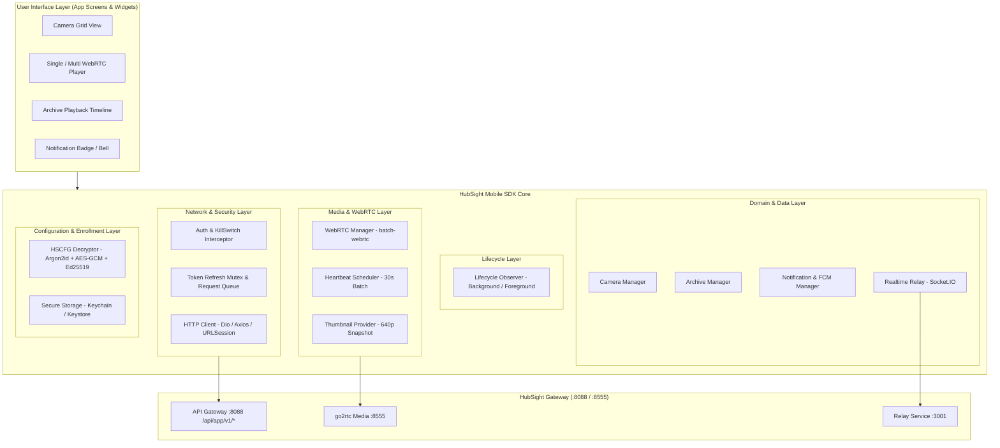
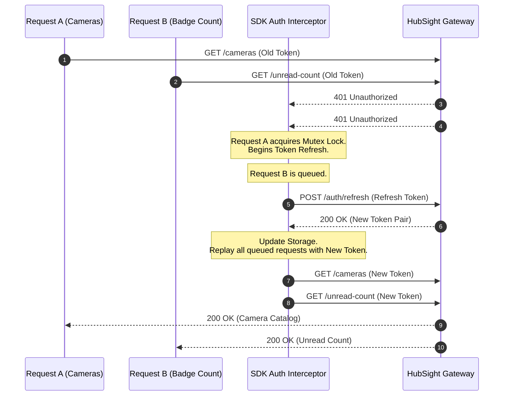

# HubSight CCTV - Mobile SDK Architecture & Best Practice Guidelines

Design guidelines, architectural patterns, and production best practices for client SDK engineers across mobile platforms (**Flutter / Dart**, **React Native / TypeScript**, **iOS Swift**, **Android Kotlin**) integrating with the **HubSight CCTV** platform via the **Mobile API (`/api/app/v1/*`)**.

---

## 1. Overview & Comparison: Web SDK vs. Mobile SDK

Within the HubSight ecosystem:
- **Web SDK (`@hubsight/sdk`)**: Built specifically for desktop browsers (React SPA), utilizing internal backend APIs (`/api/*`), direct HTML5 `<video>` tags, and browser Cookie/Storage session lifecycles.
- **Mobile SDK**: Designed specifically for native mobile constraints and operational requirements:
  1. **Zero-Config Enrollment**: Decrypts the multi-layered secure container `.hscfg` using a 6-digit PIN.
  2. **Mandatory Header & Query Authentication**: `X-API-Key` (or `?api_key=...`) and `Authorization: Bearer <token>`.
  3. **Emergency Kill-Switch Handling (HTTP 503)**: Seamlessly transitions to maintenance state when an administrator disables mobile access.
  4. **Atomic Token Refresh (Anti-Race Condition)**: Mutex lock and request queue handling when concurrent background requests fail with `401 Unauthorized`.
  5. **Battery & Bandwidth Optimization via Batch APIs**: Parallel multi-stream WebRTC negotiation (`batch-webrtc`) and unified heartbeat keep-alives (`batch-heartbeat`) for 4/9/16 camera grid layouts.
  6. **Real-Time Camera Thumbnails**: Directly displays 640p 15FPS snapshot frames via image widgets without opening heavy WebRTC peer connections.
  7. **App Lifecycle Management**: Automatically tears down WebRTC streams and pauses heartbeat timers when the app is backgrounded, conserving battery and preventing server connection pool leaks.
  8. **FCM Token & App Badge Synchronization**: Registers push tokens upon login, unregisters on logout, and synchronizes unread notification counts.

---

## 2. Layered Architecture

A standard HubSight Mobile SDK is structured into 8 independent functional layers:



---

## 3. Core Best Practices

### 3.1. Atomic Token Refresh Pattern (Eliminating 401 Race Conditions)

#### The Problem:
When the application launches or transitions from background to foreground, multiple concurrent requests trigger simultaneously: fetching the camera list, retrieving unread notification counts, loading user profile data, etc. If the Access Token has just expired, all these requests receive HTTP 401 simultaneously. Without a synchronization lock (Mutex), the SDK would issue 5-10 duplicate `POST /api/app/v1/auth/refresh` calls. The server invalidates the previous refresh token upon the first successful exchange, causing subsequent refresh calls to fail and erroneously ejecting the user back to the login screen.

#### Standard Solution:
Implement a **Mutex Lock & Request Queue Interceptor**:
1. The first request receiving a 401 acquires the lock and sets `isRefreshing = true`.
2. This request initiates `POST /api/app/v1/auth/refresh`.
3. All subsequent 401 responses while `isRefreshing == true` are appended to an asynchronous pending queue.
4. Upon successful refresh:
   - Store the new `token` and `refresh_token` into Secure Storage.
   - Iterate through the pending queue, attach the new Access Token to each request header, and replay them.
   - Reset `isRefreshing = false`.
5. If the refresh call fails (e.g. Refresh Token expired or revoked):
   - Clear tokens from Secure Storage.
   - Reject all pending requests with `HubSightSessionExpiredException`.
   - Dispatch `onSessionExpired` to route UI back to the Login screen.



---

### 3.2. Real-Time Camera Thumbnail Integration

#### Architectural Design:
- HubSight maintains a continuous internal **640p 15FPS** stream (`cam_{id}_thumb`) for all active cameras (`is_active=true` and `!is_stopped`).
- In camera list and grid views, **never instantiate WebRTC peer connections** for every cell, as this causes excessive CPU strain, exhausts cellular data, and saturates the gateway connection pool.
- Instead, utilize the snapshot thumbnail endpoint:
  ```http
  GET /api/app/v1/cameras/:id/thumbnail?api_key={apiKey}&token={userToken}
  ```

#### Mobile Implementation Rules:
1. **Query Parameter Authentication**: Popular mobile image caching libraries (`CachedNetworkImage` on Flutter, `FastImage` on React Native) manage networking caches independently and cannot easily customize per-frame HTTP headers. Always supply credentials via query parameters: `?api_key=...&token=...`.
2. **Polling & Auto-Refresh**:
   - While the camera catalog screen is active, poll snapshots every **3-5 seconds** (attaching an anti-cache timestamp: `&_t=${DateTime.now().millisecondsSinceEpoch}`).
   - Immediately cancel the timer when navigating away or when the app is backgrounded.
3. **Handling Stopped State (503 Service Unavailable)**:
   - If a camera is marked stopped by an administrator (`is_stopped = true`), the endpoint returns `503`.
   - The UI widget should catch this error and display a clean placeholder: a crossed-out camera icon with label *"Camera Stopped"*, preventing confusing network error popups.

---

### 3.3. Multi-View WebRTC & Heartbeat Batching

When displaying a multi-camera live grid (2x2, 3x3 layout):

#### 1. Batch SDP Negotiation (`batch-webrtc`):
- Instead of issuing $N$ individual HTTP requests to negotiate SDP Offers, send all offers in a **single payload**:
  ```http
  POST /api/app/v1/cameras/live/batch-webrtc
  Content-Type: application/json

  {
    "requests": [
      { "camera_id": "cam_01", "sdp_offer": "v=0..." },
      { "camera_id": "cam_02", "sdp_offer": "v=0..." }
    ]
  }
  ```
- The gateway negotiates parallel gRPC calls and returns all SDP Answers together, cutting grid initialization latency from several seconds to under 500ms.

#### 2. Unified 30-Second Heartbeat (`batch-heartbeat`):
- go2rtc and pool-service require periodic heartbeats to maintain active sessions.
- **Rule**: Maintain a single `Timer.periodic(Duration(seconds: 30))` across the entire SDK session:
  ```http
  POST /api/app/v1/cameras/live/batch-heartbeat
  { "camera_ids": ["cam_01", "cam_02"] }
  ```
- Do not allow individual camera widgets to fire independent timers; doing so causes continuous cellular radio wake-ups, severely degrading battery life.

#### 3. Simultaneous Stream Teardown (`batch-release`):
- When leaving the Multi-View screen:
  ```http
  POST /api/app/v1/cameras/live/batch-release
  { "camera_ids": ["cam_01", "cam_02"] }
  ```
- Concurrently close all client-side `RTCPeerConnection` instances and dispose `MediaStreamTrack`s.

---

### 3.4. App Lifecycle Management

Mobile operating systems (iOS/Android) strictly regulate background task execution. If an app continues pulling WebRTC streams or maintaining open socket connections when backgrounded:
- The OS flags excessive battery consumption and may terminate the app process unceremoniously.
- Server connection pools remain allocated until session timeout.

#### Golden Rules:
Listen for app lifecycle state transitions (`WidgetsBindingObserver` in Flutter, `AppState` in React Native):
1. **On `paused` / `background`**:
   - Cancel all snapshot polling timers immediately.
   - Release active WebRTC streams via `batch-release` and close peer connections.
   - Suspend Socket.IO Relay connections if background socket maintenance is unnecessary.
2. **On `resumed` / `foreground`**:
   - Verify token validity via `/api/app/v1/system/status`.
   - Re-establish live WebRTC streams or resume snapshot timers for the active view.
   - Refresh the unread notification badge counter (`/api/app/v1/notifications/unread-count`).

---

### 3.5. FCM Push Token Lifecycle & App Launcher Badges

1. **Registration Upon Login**:
   - Retrieve the device push token from the Firebase Messaging SDK and register it:
     ```http
     POST /api/app/v1/notifications/push-token
     {
       "token": "<fcm_device_token>",
       "platform": "mobile_android", // or "mobile_ios"
       "device_name": "iPhone 15 Pro"
     }
     ```
2. **Unregistration Upon Logout**:
   - When the user explicitly logs out, the client **must** call:
     ```http
     DELETE /api/app/v1/notifications/push-token
     ```
     before clearing local session tokens. This ensures subsequent users on the same shared device do not receive alerts meant for previous accounts.
3. **App Launcher Badge Sync**:
   - Call the lightweight counter API periodically or upon push receipt:
     ```http
     GET /api/app/v1/notifications/unread-count
     ```
   - Use native bridge libraries (`flutter_app_badger` or `react-native-push-notification`) to update the app icon badge count.

---

### 3.6. Emergency Kill-Switch Handling (HTTP 503)

When an administrator disables mobile client access (`app_api_enabled = false`):
- The server responds with `503 Service Unavailable`, a `Retry-After: 300` header, and JSON containing `"maintenance": true`.
- **SDK Expected Behavior**:
  - Do not treat this as an unhandled network error or crash.
  - Intercept error code `APP_API_DISABLED` or HTTP status `503`.
  - Trigger `onMaintenance(message, retryAfterSeconds)`.
  - Render a clean full-screen maintenance message with a countdown timer and a retry button.

---

## 4. Recommended Mobile SDK Architecture Directory Layout

```
hubsight_sdk/
├── lib/ (or src/)
│   ├── hubsight_sdk.dart              # Main SDK Entrypoint & Facade
│   ├── config/
│   │   ├── app_config.dart            # Configuration models from .hscfg
│   │   └── hscfg_decryptor.dart       # Argon2id + AES-GCM + Ed25519 decoder
│   ├── network/
│   │   ├── http_client.dart           # HTTP Client wrapper (Dio / Axios)
│   │   ├── auth_interceptor.dart      # Interceptor with Token Refresh Mutex
│   │   ├── endpoints.dart             # API Route Constants (/api/app/v1/*)
│   │   └── exceptions.dart            # Domain exception hierarchy
│   ├── auth/
│   │   ├── auth_manager.dart          # Login, 2FA, Logout, Session Storage
│   │   └── secure_storage.dart        # Keychain / Keystore abstraction
│   ├── cameras/
│   │   ├── camera_service.dart        # List, Detail, Status
│   │   └── camera_model.dart          # Camera entity with thumbnail_url
│   ├── media/
│   │   ├── webrtc_manager.dart        # RTCPeerConnection, SDP offer/answer
│   │   ├── multi_view_session.dart    # batch-webrtc & batch-heartbeat scheduler
│   │   └── thumbnail_provider.dart    # Authenticated snapshot URL helper
│   ├── archive/
│   │   ├── archive_service.dart       # Calendar, Timeline, Playback URL
│   │   └── recording_model.dart       # Segment video & AI event flags
│   ├── notifications/
│   │   ├── fcm_manager.dart           # Register / Unregister FCM tokens
│   │   └── notification_service.dart  # Alerts list, unread count, mark read
│   ├── realtime/
│   │   └── relay_client.dart          # Socket.IO client for realtime events
│   └── widgets/ (or components/)
│       ├── camera_thumbnail_view.dart # Auto-refreshing snapshot view widget
│       └── webrtc_video_view.dart     # Native WebRTC video rendering view
└── pubspec.yaml (or package.json)
```

---

## 5. Reference Implementations

### 5.1. Flutter / Dart SDK: Auth Interceptor & Atomic Token Refresh

```dart
import 'dart:async';
import 'package:dio/dio.dart';

class AuthInterceptor extends QueuedInterceptor {
  final Dio _dio;
  final SecureStorageService _storage;
  final String apiKey;
  final void Function()? onSessionExpired;
  final void Function(String message)? onMaintenance;

  bool _isRefreshing = false;
  final List<Completer<String?>> _refreshQueue = [];

  AuthInterceptor({
    required Dio dio,
    required SecureStorageService storage,
    required this.apiKey,
    this.onSessionExpired,
    this.onMaintenance,
  })  : _dio = dio,
        _storage = storage;

  @override
  Future<void> onRequest(
    RequestOptions options,
    RequestInterceptorHandler handler,
  ) async {
    options.headers['X-API-Key'] = apiKey;
    final token = await _storage.getAccessToken();
    if (token != null && !options.headers.containsKey('Authorization')) {
      options.headers['Authorization'] = 'Bearer $token';
    }
    return handler.next(options);
  }

  @override
  Future<void> onError(DioException err, ErrorInterceptorHandler handler) async {
    final response = err.response;

    // 1. Handle Emergency Kill-Switch
    if (response?.statusCode == 503 && response?.data?['maintenance'] == true) {
      final msg = response?.data?['message'] ?? 'System under maintenance';
      onMaintenance?.call(msg);
      return handler.next(err);
    }

    // 2. Handle Token Expiration (HTTP 401)
    if (response?.statusCode == 401 && !err.requestOptions.path.contains('/auth/')) {
      if (_isRefreshing) {
        // Another request is refreshing; wait in queue
        final completer = Completer<String?>();
        _refreshQueue.add(completer);
        final newToken = await completer.future;

        if (newToken != null) {
          err.requestOptions.headers['Authorization'] = 'Bearer $newToken';
          final cloneReq = await _dio.fetch(err.requestOptions);
          return handler.resolve(cloneReq);
        } else {
          return handler.reject(err);
        }
      }

      _isRefreshing = true;
      try {
        final refreshToken = await _storage.getRefreshToken();
        if (refreshToken == null) {
          _triggerLogout();
          return handler.reject(err);
        }

        // Issue refresh request using isolated Dio instance
        final refreshDio = Dio(BaseOptions(baseUrl: _dio.options.baseUrl));
        final refreshRes = await refreshDio.post(
          '/api/app/v1/auth/refresh',
          headers: {'X-API-Key': apiKey},
          data: {'refresh_token': refreshToken},
        );

        if (refreshRes.statusCode == 200 && refreshRes.data['token'] != null) {
          final newAccessToken = refreshRes.data['token'] as String;
          final newRefreshToken = refreshRes.data['refresh_token'] as String?;

          await _storage.saveTokens(
            accessToken: newAccessToken,
            refreshToken: newRefreshToken ?? refreshToken,
          );

          // Flush queued requests
          for (final c in _refreshQueue) {
            c.complete(newAccessToken);
          }
          _refreshQueue.clear();
          _isRefreshing = false;

          // Replay original request
          err.requestOptions.headers['Authorization'] = 'Bearer $newAccessToken';
          final cloneReq = await _dio.fetch(err.requestOptions);
          return handler.resolve(cloneReq);
        } else {
          throw Exception('Refresh failed');
        }
      } catch (e) {
        for (final c in _refreshQueue) {
          c.complete(null);
        }
        _refreshQueue.clear();
        _isRefreshing = false;
        _triggerLogout();
        return handler.reject(err);
      }
    }

    return handler.next(err);
  }

  void _triggerLogout() {
    _storage.clearTokens();
    onSessionExpired?.call();
  }
}
```

---

### 5.2. Flutter / Dart SDK: Camera Thumbnail Widget with Auto-Refresh

```dart
import 'dart:async';
import 'package:flutter/material.dart';

class HubSightCameraThumbnail extends StatefulWidget {
  final String gatewayUrl;
  final String thumbnailUrl; // e.g. "/api/app/v1/cameras/cam_01/thumbnail"
  final String apiKey;
  final String token;
  final bool isStopped;
  final Duration refreshInterval;

  const HubSightCameraThumbnail({
    Key? key,
    required this.gatewayUrl,
    required this.thumbnailUrl,
    required this.apiKey,
    required this.token,
    this.isStopped = false,
    this.refreshInterval = const Duration(seconds: 4),
  }) : super(key: key);

  @override
  State<HubSightCameraThumbnail> createState() => _HubSightCameraThumbnailState();
}

class _HubSightCameraThumbnailState extends State<HubSightCameraThumbnail> {
  Timer? _timer;
  int _timestamp = DateTime.now().millisecondsSinceEpoch;

  @override
  void initState() {
    super.initState();
    _startTimer();
  }

  void _startTimer() {
    if (widget.isStopped) return;
    _timer = Timer.periodic(widget.refreshInterval, (_) {
      if (mounted) {
        setState(() {
          _timestamp = DateTime.now().millisecondsSinceEpoch;
        });
      }
    });
  }

  @override
  void dispose() {
    _timer?.cancel();
    super.dispose();
  }

  @override
  Widget build(BuildContext context) {
    if (widget.isStopped) {
      return Container(
        color: Colors.black87,
        child: const Center(
          child: Column(
            mainAxisSize: MainAxisSize.min,
            children: [
              Icon(Icons.videocam_off, color: Colors.grey, size: 36),
              SizedBox(height: 8),
              Text('Camera Stopped', style: TextStyle(color: Colors.grey, fontSize: 12)),
            ],
          ),
        ),
      );
    }

    final fullUrl = '${widget.gatewayUrl}${widget.thumbnailUrl}'
        '?api_key=${widget.apiKey}&token=${widget.token}&_t=$_timestamp';

    return Image.network(
      fullUrl,
      fit: BoxFit.cover,
      gaplessPlayback: true, // Prevents screen flickering during frame transitions
      errorBuilder: (context, error, stackTrace) {
        return Container(
          color: Colors.black54,
          child: const Center(
            child: Icon(Icons.broken_image, color: Colors.white30, size: 32),
          ),
        );
      },
    );
  }
}
```

---

### 5.3. Flutter / Dart SDK: WebRTC Multi-View & Batch Heartbeat Scheduler

```dart
import 'dart:async';
import 'package:dio/dio.dart';
import 'package:flutter_webrtc/flutter_webrtc.dart';

class MultiViewStreamSession {
  final Dio _dio;
  final Map<String, RTCPeerConnection> _activeConnections = {};
  final Map<String, RTCVideoRenderer> _renderers = {};
  Timer? _heartbeatTimer;

  MultiViewStreamSession(this._dio);

  /// Concurrently opens camera streams via batch-webrtc
  Future<void> startStreams(List<String> cameraIds) async {
    final batchRequests = <Map<String, dynamic>>[];

    // 1. Create local RTCPeerConnections concurrently
    for (final camId in cameraIds) {
      final pc = await createPeerConnection({
        'iceServers': [],
      });
      final renderer = RTCVideoRenderer();
      await renderer.initialize();

      pc.onTrack = (event) {
        if (event.track.kind == 'video') {
          renderer.srcObject = event.streams[0];
        }
      };

      await pc.addTransceiver(
        kind: RTCRtpMediaType.RTCRtpMediaTypeVideo,
        init: RTCRtpTransceiverInit(direction: TransceiverDirection.RecvOnly),
      );

      final offer = await pc.createOffer();
      await pc.setLocalDescription(offer);

      _activeConnections[camId] = pc;
      _renderers[camId] = renderer;

      batchRequests.add({
        'camera_id': camId,
        'sdp_offer': offer.sdp,
      });
    }

    // 2. Transmit single batch negotiation request to server
    final response = await _dio.post(
      '/api/app/v1/cameras/live/batch-webrtc',
      data: {'requests': batchRequests},
    );

    final results = response.data['results'] as List<dynamic>;
    for (final item in results) {
      final camId = item['camera_id'] as String;
      final answerSdp = item['sdp_answer'] as String?;
      final success = item['success'] as bool? ?? false;

      if (success && answerSdp != null && _activeConnections.containsKey(camId)) {
        final pc = _activeConnections[camId]!;
        await pc.setRemoteDescription(RTCSessionDescription(answerSdp, 'answer'));
      }
    }

    // 3. Initiate periodic 30s heartbeat
    _startHeartbeat(cameraIds);
  }

  void _startHeartbeat(List<String> cameraIds) {
    _heartbeatTimer?.cancel();
    _heartbeatTimer = Timer.periodic(const Duration(seconds: 30), (_) async {
      try {
        await _dio.post(
          '/api/app/v1/cameras/live/batch-heartbeat',
          data: {'camera_ids': cameraIds},
        );
      } catch (_) {}
    });
  }

  /// Teardown streams and release resources
  Future<void> stopAll() async {
    _heartbeatTimer?.cancel();
    final camIds = _activeConnections.keys.toList();

    if (camIds.isNotEmpty) {
      try {
        await _dio.post(
          '/api/app/v1/cameras/live/batch-release',
          data: {'camera_ids': camIds},
        );
      } catch (_) {}
    }

    for (final pc in _activeConnections.values) {
      await pc.close();
    }
    for (final r in _renderers.values) {
      await r.dispose();
    }
    _activeConnections.clear();
    _renderers.clear();
  }

  RTCVideoRenderer? getRenderer(String cameraId) => _renderers[cameraId];
}
```

---

### 5.4. React Native / TypeScript: Axios Interceptor with Queueing

```typescript
import axios, { AxiosInstance, InternalAxiosRequestConfig } from 'axios';
import * as Keychain from 'react-native-keychain';

export function setupMobileApiClient(
  baseUrl: string,
  apiKey: string,
  onSessionExpired: () => void,
  onMaintenance: (message: string) => void
): AxiosInstance {
  const client = axios.create({
    baseURL: baseUrl,
    headers: { 'X-API-Key': apiKey },
  });

  let isRefreshing = false;
  let failedQueue: Array<{
    resolve: (token: string) => void;
    reject: (error: any) => void;
  }> = [];

  const processQueue = (error: any, token: string | null = null) => {
    failedQueue.forEach((prom) => {
      if (error) {
        prom.reject(error);
      } else {
        prom.resolve(token!);
      }
    });
    failedQueue = [];
  };

  client.interceptors.request.use(async (config: InternalAxiosRequestConfig) => {
    const creds = await Keychain.getGenericPassword({ service: 'hubsight_auth' });
    if (creds && !config.headers.Authorization) {
      const { accessToken } = JSON.parse(creds.password);
      config.headers.Authorization = `Bearer ${accessToken}`;
    }
    return config;
  });

  client.interceptors.response.use(
    (response) => response,
    async (error) => {
      const originalRequest = error.config;

      // 1. Handle Kill-Switch
      if (error.response?.status === 503 && error.response?.data?.maintenance) {
        onMaintenance(error.response.data.message || 'System under maintenance');
        return Promise.reject(error);
      }

      // 2. Handle 401 and Token Refresh Queue
      if (error.response?.status === 401 && !originalRequest._retry && !originalRequest.url?.includes('/auth/')) {
        if (isRefreshing) {
          return new Promise((resolve, reject) => {
            failedQueue.push({ resolve, reject });
          })
            .then((token) => {
              originalRequest.headers.Authorization = `Bearer ${token}`;
              return client(originalRequest);
            })
            .catch((err) => Promise.reject(err));
        }

        originalRequest._retry = true;
        isRefreshing = true;

        try {
          const creds = await Keychain.getGenericPassword({ service: 'hubsight_auth' });
          if (!creds) throw new Error('No credentials');

          const { refreshToken } = JSON.parse(creds.password);
          const res = await axios.post(`${baseUrl}/api/app/v1/auth/refresh`, {
            refresh_token: refreshToken,
          }, {
            headers: { 'X-API-Key': apiKey }
          });

          const { token: newAccessToken, refresh_token: newRefreshToken } = res.data;
          await Keychain.setGenericPassword(
            'session',
            JSON.stringify({
              accessToken: newAccessToken,
              refreshToken: newRefreshToken || refreshToken,
            }),
            { service: 'hubsight_auth' }
          );

          processQueue(null, newAccessToken);
          originalRequest.headers.Authorization = `Bearer ${newAccessToken}`;
          return client(originalRequest);
        } catch (refreshErr) {
          processQueue(refreshErr, null);
          await Keychain.resetGenericPassword({ service: 'hubsight_auth' });
          onSessionExpired();
          return Promise.reject(refreshErr);
        } finally {
          isRefreshing = false;
        }
      }

      return Promise.reject(error);
    }
  );

  return client;
}
```

---

## 6. Production Readiness Checklist

Before releasing applications or distributing the SDK, verify compliance against this checklist:

| No. | Verification Item | Technical Requirement | Status |
| :---: | :--- | :--- | :---: |
| 1 | **Key & Token Storage** | Access/Refresh tokens and `.hscfg` decryption secrets are stored in Keychain (iOS) / Keystore (Android). Never store plaintext credentials in SharedPreferences or AsyncStorage. | [ ] |
| 2 | **Centralized Gateway Routing** | All HTTP and WebSocket calls route through Gateway port `:8088` (or the primary production domain). No direct calls to internal microservice ports (`:8080`, `:8081`, `:3001`). | [ ] |
| 3 | **Atomic 401 Token Refresh** | Verified with 10 concurrent requests upon token expiration: only 1 refresh request is issued, and all 10 requests complete successfully without unexpected logouts. | [ ] |
| 4 | **Performant Snapshot Widgets** | Camera lists utilize 640p 15FPS snapshots via `thumbnail_url`. Enabled `gaplessPlayback` to prevent frame flicker. Polling timers are cancelled on exit. | [ ] |
| 5 | **Multi-View Batching** | Grid layouts employ `batch-webrtc` for connection setup and `batch-heartbeat` for 30s keep-alives. `batch-release` executes upon screen exit. | [ ] |
| 6 | **Background Lifecycle** | WebRTC streams are torn down and timers stopped when app enters background state. Streams restore cleanly upon resume without connection leaks. | [ ] |
| 7 | **FCM Token Lifecycle** | Push tokens are registered upon login and unregistered upon logout, preventing orphaned alert deliveries. | [ ] |
| 8 | **Kill-Switch Handling (HTTP 503)** | When mobile access is disabled by an administrator, the app displays a clear maintenance screen with retry options without crashing. | [ ] |

---

## 7. Reference Documentation

- [Mobile Application API Specification (`APP_API_SPECIFICATION.md`)](APP_API_SPECIFICATION.md)
- [Configuration Container Format (`APP_CONFIG_SPECIFICATION.md`)](APP_CONFIG_SPECIFICATION.md)
- [Login Security & Session Architecture (`SECURITY_FOR_LOGIN.md`)](SECURITY_FOR_LOGIN.md)
