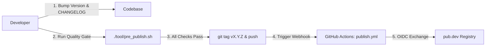

# Standard Operating Procedure: Publishing to pub.dev

This document establishes the official standard operating procedure (SOP) for releasing and maintaining the **`hubsight_sdk`** package on [pub.dev](https://pub.dev).

---

## 1. Overview & Architecture

To achieve the maximum **140/140 Pub Points** and prevent human error during releases, `hubsight_sdk` utilizes a two-tier publishing model:

1. **Local Pre-Publish Quality Gatekeeper (`tool/pre_publish.sh`)**: Runs formatting, strict linter, unit test suites, changelog verification, and dry-run validation locally before any tag is created.
2. **Automated CD Publishing via OpenID Connect (OIDC)**: Employs GitHub Actions (`.github/workflows/publish.yml`) with tokenless OIDC workload identity federation to publish releases directly to pub.dev without storing long-lived personal tokens.



---

## 2. Prerequisites & Setup on pub.dev

### 2.1. Publisher Verification
For enterprise credibility, `hubsight_sdk` should be published under a **Verified Publisher** (e.g. `hubsight.com`):
1. Navigate to [pub.dev/create-publisher](https://pub.dev/create-publisher).
2. Enter your organization domain (e.g. `hubsight.com`).
3. Complete DNS TXT record verification via Google Search Console.
4. Add core team members as administrators under **Publisher Admin**.

### 2.2. Enabling Automated Publishing via GitHub Actions (OIDC)
Pub.dev supports tokenless publishing through GitHub Actions Workload Identity:
1. Publish the initial release `1.0.0` (either manually or via publisher admin).
2. On `https://pub.dev/packages/hubsight_sdk/admin`, navigate to the **Publishing** tab.
3. Check **"Publish from GitHub Actions"**.
4. Configure the integration:
   - **GitHub repository**: `HubSight/flutter-sdk`
   - **Publishing branch or tag**: Check **"Publish on tag"** and set tag pattern to `v*`.
5. Save changes. No secret tokens or credentials need to be stored in GitHub Secrets!

---

## 3. Semantic Versioning Standards (SemVer 2.0.0)

All releases follow strict `MAJOR.MINOR.PATCH` increments:

| Level | When to Bump | Example |
| :--- | :--- | :--- |
| **PATCH** (`1.0.x`) | Bug fixes, internal performance optimizations, error code mappings, or documentation improvements that do not alter public APIs. | `1.0.0` $\rightarrow$ `1.0.1` |
| **MINOR** (`1.x.0`) | Backward-compatible feature additions (e.g., adding PTZ camera commands, WebRTC two-way audio support, or new notification filters). | `1.0.1` $\rightarrow$ `1.1.0` |
| **MAJOR** (`x.0.0`) | Breaking changes to existing public APIs, removal of deprecated methods, or major refactoring requiring consuming app code updates. | `1.1.0` $\rightarrow$ `2.0.0` |

---

## 4. Release Procedure (Step-by-Step SOP)

Follow these exact steps to prepare and release a new version:

### Step 1: Update Version in `pubspec.yaml`
Open `pubspec.yaml` and update the version number:
```yaml
name: hubsight_sdk
version: 1.0.1
```

### Step 2: Document Release in `CHANGELOG.md`
Open `CHANGELOG.md` and add a new section above previous versions:
```markdown
## 1.0.1 - 2026-09-12

### Added
- PTZ camera preset position recall.

### Fixed
- Resolved minor reconnection timeout when switching cellular networks.
```

### Step 3: Run the Pre-Publish Quality Gatekeeper
Execute the pre-publish gatekeeper script from the root workspace:
```bash
./tool/pre_publish.sh
```

The script automatically executes and validates:
- [x] **Git Status**: Verifies there are no uncommitted or untracked changes.
- [x] **Code Formatting**: Runs `dart format --output=none --set-exit-if-changed .`.
- [x] **Static Code Analysis**: Runs `dart analyze --fatal-infos`.
- [x] **Automated Tests**: Runs `flutter test` across all unit test suites.
- [x] **Version Consistency**: Ensures the version in `pubspec.yaml` matches an entry in `CHANGELOG.md`.
- [x] **Dry-Run Package Validation**: Runs `flutter pub publish --dry-run` to ensure zero warnings.

### Step 4: Commit the Release Preparation
```bash
git add pubspec.yaml CHANGELOG.md
git commit -m "chore(release): prepare v1.0.1"
git push origin main
```

### Step 5: Tag & Deploy
Create the annotated git tag matching the version and push it to GitHub:
```bash
git tag v1.0.1
git push origin v1.0.1
```

Once pushed, GitHub Actions automatically starts the **Publish to pub.dev** workflow:
- Validates the environment.
- Exchanges OIDC tokens with Google's authentication service.
- Deploys `hubsight_sdk 1.0.1` directly to [pub.dev/packages/hubsight_sdk](https://pub.dev/packages/hubsight_sdk).

---

## 5. Fallback: Manual Publishing

If CI/CD is temporarily disabled or for initial package bootstrapping:

1. Ensure all quality checks pass:
   ```bash
   ./tool/pre_publish.sh
   ```
2. Execute the interactive publish command:
   ```bash
   flutter pub publish
   ```
3. Open the provided Google authentication URL in your browser and log in with your authorized publisher account.
4. Confirm publication in the terminal:
   ```
   Publishing hubsight_sdk 1.0.0 to https://pub.dev:
   Do you want to publish hubsight_sdk 1.0.0 (y/N)? y
   Successfully published hubsight_sdk 1.0.0.
   ```

---

## 6. Post-Release Verification

1. **Verify Package on pub.dev**: Visit `https://pub.dev/packages/hubsight_sdk` and verify that the new version is live.
2. **Review Pub Points Breakdown (Target: 140/140)**:
   - **Follow Dart file conventions**: Pass (10/10)
   - **Provide documentation**: Pass (10/10)
   - **Platform support**: Pass (20/20) - iOS, Android, macOS, Windows, Linux detected.
   - **Pass static analysis**: Pass (50/50) - 0 issues with `dart analyze`.
   - **Support up-to-date dependencies**: Pass (40/40) - Modern version constraints.
   - **Provide example**: Pass (10/10) - Complete sample in `example/lib/main.dart`.
3. **Verify API Documentation**: Ensure dartdoc rendered cleanly under the **API reference** tab.
